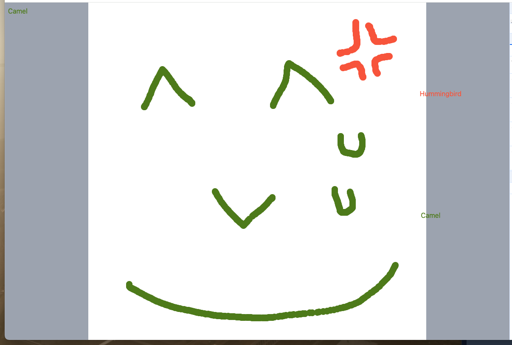

# django-channels-tutorial

Django Channels の機能を使って、簡易的な複数人お絵かきアプリを作ります。

他のクライアントの操作を、WebSocket を使って送受信します。


このリポジトリはチュートリアルの成果物です。

実際のチュートリアルは、このリポジトリに含まれるコードは使わずに、この README の内容だけで完結します。


## プロジェクトフォルダの作成

```shell
mkdir django-channels-tutorial

cd django-channels-tutorial

vim Pipfile
```

### Pipfile
```toml
[[source]]
name = "pypi"
url = "https://pypi.org/simple"
verify_ssl = true

[dev-packages]

[packages]
django = "~=5.0"
redis = "*"
channels = "*"
daphne = "*"

[requires]
python_version = "3.12"
```

`daphne` をインストールしています。 `daphne` は、ASGI モードの `runserver` を提供しています。


```shell
pipenv install
```

```shell
pipenv shell
```

```shell
django-admin startproject django_channels_tutorial
```


一旦 runserverして、初期ページを表示してみます。

```shell
./manage.py runserver
```

## エディターのセットアップ

PyCharm なら

- Python Interpreter
- Enable Django Support
- Project Structure

の設定をする。最近の PyCharm は自動認識している。

デバッグ実行してみて初期ページが表示されればOK


## ASGI (daphne) に切り替える

settings.py を修正します。

`INSTALLED_APPS` の一番上に `'daphne',` を追加


```
WSGI_APPLICATION = 'django_channels_tutorial.wsgi.application'
```

をコメントアウトし、その下に

```
ASGI_APPLICATION = 'django_channels_tutorial.asgi.application'
```

を追加。

テスト実行します。

ページの見た目は変わらないが、Django が非同期モードで動作している。


https://channels.readthedocs.io/en/latest/installation.html


## Webインターフェイスの作成

### django-channels-tutorial/django_channels_tutorial/django_channels_tutorial/templates/index.html

```html
<html lang="ja">
<head>
  <title>WebSocket Scratch</title>
  <meta charset="UTF-8">
  <meta name="viewport" content="width=device-width, initial-scale=1.0">
  <script src="https://cdn.tailwindcss.com"></script>
  <style>
    .max-square {
      width: min(100vw, 100vh);
      height: min(100vw, 100vh);
    }
    .paint-dot {
      position: absolute;
      width: 2%;
      height: 2%;
      border-radius: 50%;
      pointer-events: none;
    }
    .name-label {
      position: absolute;
      pointer-events: none;
    }
  </style>
</head>
<body>
<div class="flex items-center justify-center h-screen bg-gray-400">
  <div class="max-square bg-white relative" id="playarea">
  </div>
</div>
<div class="fixed top-0 left-0 p-2">
  <div id="user"></div>
</div>
<script>
  const playarea = document.getElementById('playarea');

  // WebSocket クライアントを作成
  // 本来は様々なエラーハンドリングが必要だが今回はチュートリアルのため省略している
  const websocket = new WebSocket('ws://' + window.location.host + '/ws/');

  // 自分のユーザー情報を作成
  const userId = Math.random().toString(32).substring(2);
  const userName = pickPresetName();
  const userColor = pickRandomColor();

  const userSpan = document.createElement('span');
  userSpan.style.color = userColor;
  userSpan.innerText = userName;
  document.getElementById('user').appendChild(userSpan);

  // 他のユーザーのラベルエレメントを入れるもの
  const nameLabels = {};

  /**
   * WebSocket からメッセージを受信し、描画する
   */
  websocket.onmessage = (e) => {
    console.log('onmessage', e.data)
    const data = JSON.parse(e.data);
    if (data.type === 'mousemove') {
      if (data.click) {
        const div = document.createElement('div');
        div.className = 'paint-dot';
        div.style.left = `${data.xRatio * 100 - 1}%`;
        div.style.top = `${data.yRatio * 100 - 1}%`;
        div.style.backgroundColor = data.userColor;
        playarea.appendChild(div);
      }

      if (!nameLabels[data.userId]) {
        const nameLabel = document.createElement('div');
        nameLabel.className = 'name-label';
        nameLabel.style.color = data.userColor;
        nameLabel.innerText = data.userName;
        nameLabels[data.userId] = nameLabel;
        playarea.appendChild(nameLabel);
      }
      nameLabels[data.userId].style.left = `${data.xRatio*100}%`;
      nameLabels[data.userId].style.top = `${data.yRatio*100 + 2}%`;
    }
  };

  /**
   * マウスを動かしたことを WebSocket に送信
   */
  playarea.addEventListener('mousemove', (e) => {
    // playarea に対しての X, Y座標を取得する
    const x = e.offsetX;
    const y = e.offsetY;

    // 場所を割合に変換
    const xRatio = x / playarea.clientWidth;
    const yRatio = y / playarea.clientHeight;

    websocket.send(JSON.stringify({
      type: 'mousemove',
      xRatio: xRatio,
      yRatio: yRatio,
      userId: userId,
      userName: userName,
      userColor: userColor,
      click: e.buttons === 1,
    }));
  });

  /**
   * 適当なユーザー名を選択
   */
  function pickPresetName() {
    // 適当な名前
    const presetNames = [
      'Willow Grouse',
      'Swan',
      'Crane',
      'Condor',
      'Harpy Eagle',
      'Hawk',
      'Cassowary',
      'Black-headed Gull',
      'Osprey',
      'White-tailed Eagle',
      'Long-eared Bandicoot',
      'Keel-billed Toucan',
      'Manatee',
      'Jackal',
      'Giant Anteater',
      'Ostrich',
      'Owl',
      'Japanese Macaque',
      'Malayan Tapir',
      'Polar Bear',
      'Baboon',
      'Peacock',
      'Giant Anteater',
      'African Elephant',
      'American Bison',
      'Reticulated Giraffe',
      'Sandbar Shark',
      'Cat',
      'Pond Turtle',
      'Gecko',
      'Frilled Lizard',
      'Humboldt Penguin',
      'Galapagos Penguin',
      'Hummingbird',
      'Moose',
      'Antelope',
      'Tibetan Yak',
      'Coyote',
      'Camel',
      'Golden Takin',
      'Vanuatu Tree Lobster',
      'Sperm Whale',
      'Swordfish',
      'Sawfish',
      'Marlin',
    ];
    return presetNames[Math.floor(Math.random() * presetNames.length)];
  }

  /**
   * 適当な色を選択
   */
  function pickRandomColor() {
    const _h = Math.floor(Math.random() * 360);
    const _s = Math.floor(Math.random() * 70) + 30;
    const _l = Math.floor(Math.random() * 40) + 25;
    return `hsl(${_h}, ${_s}%, ${_l}%)`;
  }
</script>
</body>
</html>

```

### django-channels-tutorial/django_channels_tutorial/django_channels_tutorial/urls.py

上記 index.html を使う TemplateView を追加

```python
from django.contrib import admin
from django.urls import path
from django.views.generic import TemplateView


urlpatterns = [
    path('', TemplateView.as_view(template_name='index.html'), name='index'),
    path('admin/', admin.site.urls),
]
```


### django-channels-tutorial/django_channels_tutorial/django_channels_tutorial/settings.py

INSTALLED_APPS の一番上に 'django_channels_tutorial' を追加

```python
INSTALLED_APPS = [
    'django_channels_tutorial',  # 追加
    'daphne',
    'django.contrib.admin',
    ...
]
```

ブラウザでページを表示する。

WebSocket に接続できないためエラーになる。


## Channels の組み込み

### django-channels-tutorial/django_channels_tutorial/django_channels_tutorial/consumers.py

受信したデータを、同じチャンネルグループにそのまま送るだけのコンシューマーを作る。

本来は Django の認証機能やデータベースと組み合わせて機能を作れるが、今回は極めて簡易的なものにした。


```python
import json

from channels.generic.websocket import AsyncJsonWebsocketConsumer


class TutorialConsumer(AsyncJsonWebsocketConsumer):

    async def connect(self):
        """
        クライアントが WebSocket に接続した時
        """
        print(f'[{self.channel_name}] connect')
        # クライアントを broadcast グループに追加
        await self.channel_layer.group_add(
            'broadcast',
            self.channel_name,
        )
        # connect の最後に accept() する。
        await self.accept()

    async def disconnect(self, _close_code):
        """
        切断時の処理
        """
        print(f'[{self.channel_name}] disconnect')
        await self.channel_layer.group_discard(
            'broadcast',
            self.channel_name,
        )
        await self.close()

    async def receive_json(self, data):
        """
        WebSocket からイベントを受信した時
        """
        print(f'[{self.channel_name}] receive_json: {data}')
        # 第二引数の type の . を _ に置換した、self のメソッドを、
        # 指定したグループの全てのクライアントに対して実行する。
        await self.channel_layer.group_send(
            'broadcast',
            {'type': 'broadcast.message', 'data': data}
        )

    async def broadcast_message(self, event):
        print(f'[{self.channel_name}] broadcast_message: {event}')
        data = event['data']
        await self.send(text_data=json.dumps(data))
```

### django-channels-tutorial/django_channels_tutorial/django_channels_tutorial/routing.py

WebSocket のパスルーティングを行う。

```python
from django.urls import path

from .consumers import TutorialConsumer

websocket_urlpatterns = [
    path('ws/', TutorialConsumer.as_asgi()),
]
```

### django-channels-tutorial/django_channels_tutorial/django_channels_tutorial/settings.py

settings.py の末尾に追加。channels のバックエンドに何を使うかを指定する。
通常は Redis を使う。今回はチュートリアルのため、簡易的にローカルメモリーを使う。

```python
CHANNEL_LAYERS = {
    'default': {
        # チュートリアルなので簡易的にローカルメモリーでやる。
        'BACKEND': 'channels.layers.InMemoryChannelLayer'
        # 実運用時は Redis を使う。
        # redis を起動するには
        # docker run --rm -p 6379:6379 redis:7
        # pipenv install channels_redis
        # 'BACKEND': 'channels_redis.core.RedisChannelLayer',
        # 'CONFIG': {
        #      'hosts': ['redis://127.0.0.1:6379/5'],
        # },
    },
}
```

### django-channels-tutorial/django_channels_tutorial/django_channels_tutorial/asgi.py
asgi.py で、プロトコル別にルーティングを切り替えることができる。

```python

import os

from django.core.asgi import get_asgi_application
from channels.routing import ProtocolTypeRouter, URLRouter
from . import routing

os.environ.setdefault('DJANGO_SETTINGS_MODULE',
                      'django_channels_tutorial.settings')

application = ProtocolTypeRouter(
    {
        'http': get_asgi_application(),
        'websocket': URLRouter(
            routing.websocket_urlpatterns,
        ),
    }
)
```
